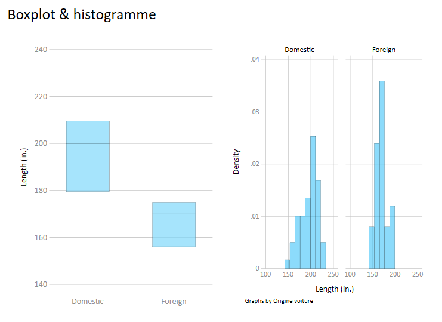
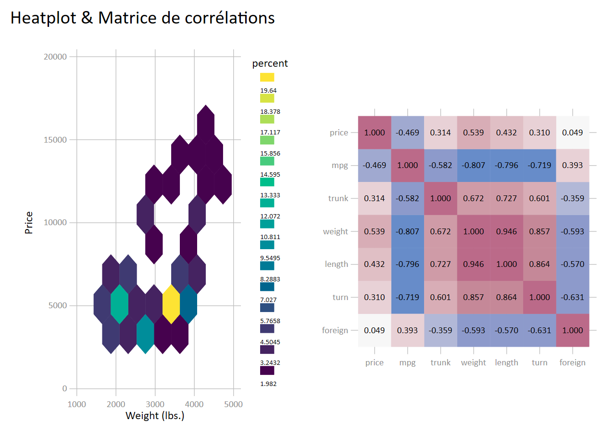
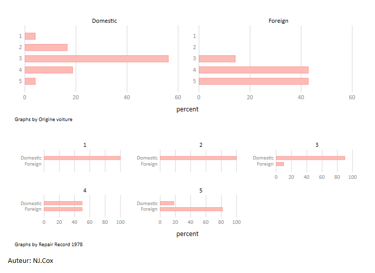
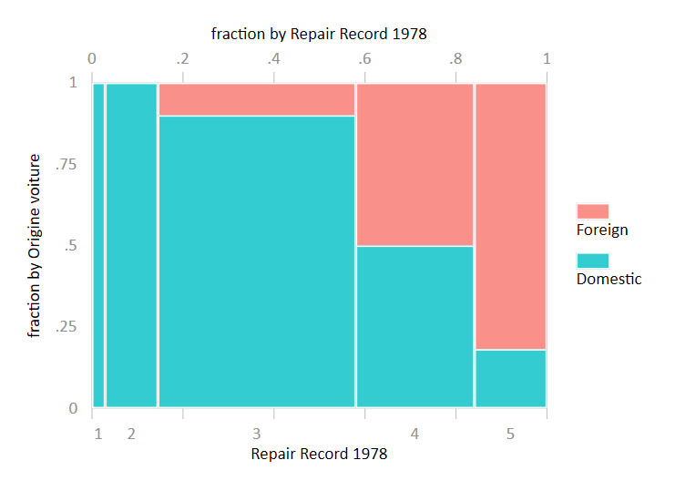
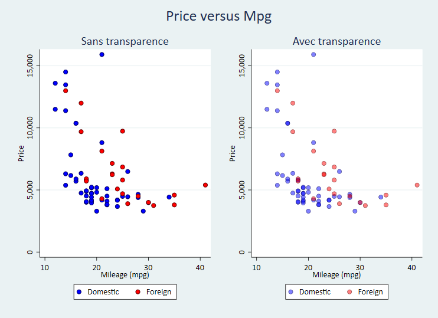
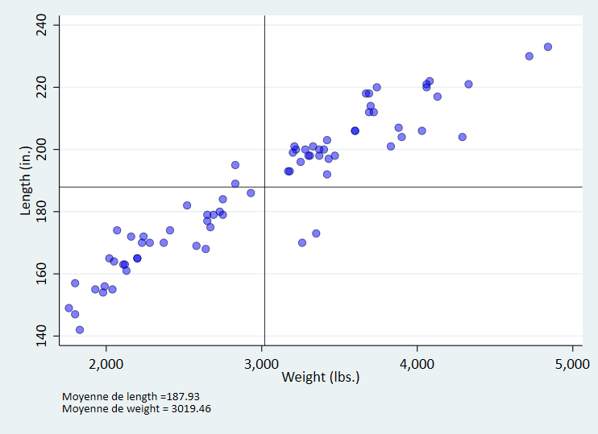
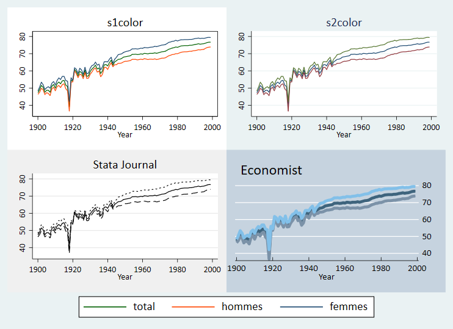
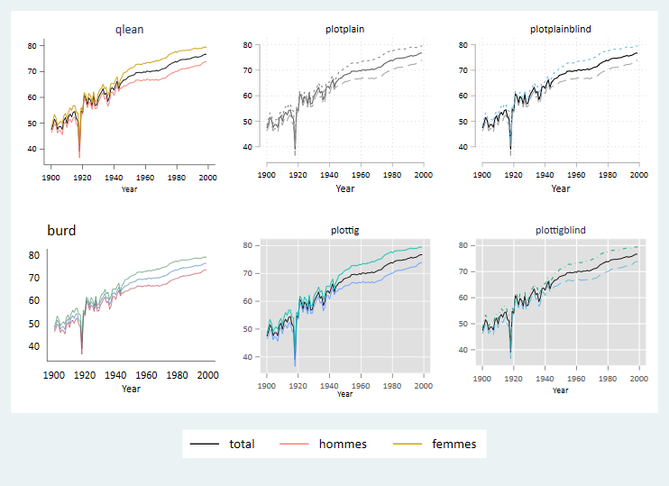
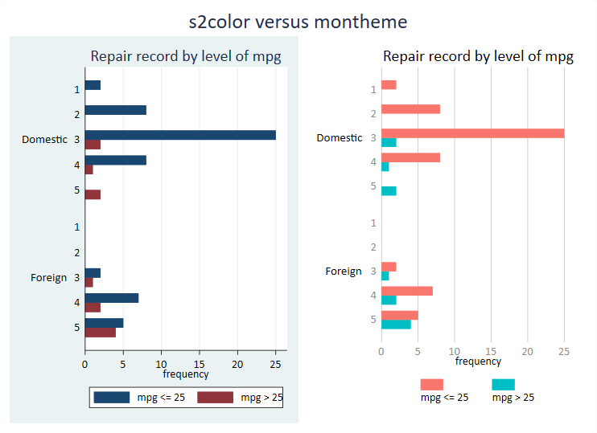

```{r setup, include=FALSE}
knitr::opts_chunk$set(echo = TRUE)

```


Pour commencer: 

* Ouvrir une session Stata
* Ouvrir un log de session: `file` => `log` => `begin`
* Dans la fenêtre **command** de l'environnement principal, exécuter la ligne ```sysuse auto```

```{}
sysuse auto.dta
```


# Présentation

## Historique de Stata
L'entreprise Stata Corp Lp a été fondée par W.Gould. Il est toujours à la tête de l'entreprise. 

* Première version (sous MS Dos) en janvier 1985.  
* Première version Windows en 1995 (Stata 4).  
* La version la plus récente est la 16 (printemps 2019).  

## STATA à l'Ined

Version 14 Windows déployée, les maj vers la version 16 achetée.   
Version 15 SE sous Linux (serveur margaux.  

Petit rappel pour l'Ined: Quel que soit le logiciel choisi sous environnement Windows (SAS v9.4 ou Stata) vous avez accès à une version de l'autre application sous Linux via le serveur Margaux (SAS Studio ou STATA v15 SE).

A l'Ined, 2 types de versions Windows mise à disposition (selon les besoins).  
<br>
**Version SE: Standard Edition**  

* Nombre d'observations: 2.14 milliards
* Nombre de variables dans les bases: 32 767
* Nombre de variables RHS (limite nombre de colonnes des matrices: 10998)  

**Version IC: version bridée**  

* Nombre d'observations: 2.14 milliards
* Nombre de variables dans les bases: 2048
* Nombre de variables RHS (limite nombre de colonnes des matrices): 798)  


Il existe également la version MP (Multiple Process) plus puissante: 120000 variables, 20 milliards d'observations).  

## Les ressources

### Les ressources externes

* Les manuels édités par STATA. Certains sont disponibles  au GED  [http://www.stata.com/bookstore/books-on-stata] 

* Stata Journal, la revue trimestrielle éditée par Stata [http://www.stata-journal.com  ]. Depuis 2015 accès total aux versions PDF (via portail GED)

* Une chaîne Youtube [http://www.youtube.com/user/statacorp/videos?view=0] qui propose des tutoriels via les manips par les boites de dialogue.

* Un forum particulièrement actif (https://www.statalist.org/) [En anglais seulement]

* Site de l'UCLA: https://stats.idre.ucla.edu/stata/  https://stats.idre.ucla.edu/stata/modules/


### Les ressources internes

- Le manuel de Stata  est directement intégré au logiciel. Pour y accéder à  partir du menu : `help => PDF documentation`

- Pour une instruction, on peut obtenir son aide en tapant dans la fenêtre *command* de l'environnement principal help command.  

 ```{}
help summarize
```
 
**Les pages d'aides**  

En haut de la fenêtre (sous title), on peut accéder directement à la section du PDF en cliquant sur le lien (idem pour les options).    
L'accès aux aides est également possible à partir des bo?tes de dialogue (voir plus bas).      
L'aide comprend généralement:  

* le nom de la commande
* le lien vers l'entrée du manuel (si commande officielle)
* la description de la syntaxe
* le détail des options
* des exemples avec éventuellement une exécution directe (voir avec ```help tw```)
* les informations sauvegardés temporairement  (jusqu'à l'exécution d'une autre commande) => *stored results*.

- L'instruction ```findit nom_command```  permet d'obtenir la liste de toutes les ressources disponibles d'une commande, internes ou externes. Exemple: ```findit fitstat```

## Warning: compatibilité entre les versions

Assez régulièrement, des probl?mes de compatibilité entre les versions de Stata se sont posés. Cela affecte la lecture des bases entre les différentes versions du logiciel. C'est le cas entre la version 14 et les versions antérieures (dont la version 13 qui date de 2012).   

Version 14 (idem 15,16): refonte total du système d'encodage vers le standard UTF8.    
Les versions inférieures ne peuvent pas ouvrir les bases, qui doivent être enregistrées avec une commande particulière (`saveold`) sous Stata14-15-16. Les accents ne sont pas lu après cette conversion, et ce qui nécessite d'exécuter un programme pour les convertir (au secours!!!!).  
<br>
A l'Ined, depuis le déploiement de la version 14 et le passage à la version 15 Linux, il n'y a plus de problème. Attention toutefois pour les collaborations avec l'extérieur (version 13 encore largement utilisée).  


## Les users packages

Stata fonctionne avec un double système de commandes officielles et de commandes externes (idem R).  

Commandes externes (user package):  

- Il s'agit d'instructions créees par les utilisateurs

- Ces instructions couvrent le data management et l'analyse statistique (descriptive, modélisation, graphiques)

- Même syntaxe que les instructions officielles

- La liste (triée par année) de ces instructions se trouve à cette adresse [http://ideas.repec.org/s/boc/bocode.html]. Elle n'est pas exhaustive, seulement celles sur le dépôt de Stata (autres dépôts: université, institut de recherche, et les git) 


**Installation d'une commande externe**   
Pour télécharger un package, on peut utiliser la ligne de commande:

```{}
ssc install nom_commande, replace
```


**Exo**

* [1] Accéder à l'aide (pdf) de l'instruction ```tabulate```.  Faire un tableau croisé entre la variable **foreign** et **rep78**
* [2]	Installer le package externe ```findname```, exécuter ```findname t*``` et chercher les variables de type chaine de caractère (string)


## Points forts et points faible selon MT

**Points forts** 

* L'interface et son interactivité

* La simplicit? du langage de base. Très bonne courbe d'apprentissage 

* Accès aux instructions/packages externes. Même syntaxe que l'officielle  (mais warning sur la certification des packages).

* Les variables systèmes de comptage.

* Automatisation des programmes via les macro variables et les boucles. Intuitif.

* Paramétrisation poussée d'une session avec l'édition d'un fichier ```profile.do```


**Points faibles**  

* Problèmes de compatibilités entre les versions, noms d'instructions qui peuvent changer entre les versions

* Une seule base en mémoire lors de la session : obligation de sauvegarder pour en ouvrir une autre (avec option clear). Mais possibilité de contourner cette faiblesse. MAJ v16: implémentation d'un système de ```frame```

*Aspect des outputs sommaires. Des packages externes comblent en partie ce problème. Idem pour les graphiques

* Bien que l'interface soit de très bonne qualité, il n'est pas possible d'ancrer l'éditeur de programme dans l'interface principale (en la substituant à la fenêtre command par exemple) 


**Faux problème (du point de vue de SAS)** 

* Absence de librairie temporaire: Un système de *trash box*  est possible (+ création automatique d'un log de session). Voir avec MT

* Chargement de plusieurs répertoires (*libname*). Idem voir avec MT pour la solution avec les macro variables + ```frame```  à partir de la version 16


# L'environnement

## Les (principaux) types de fichier 

* Les bases de données: **.dta**

* L'éditeur de programme : **.do** (**.ado** pour la programmation de commandes)

* Le log de session : **.smcl** ou **.log** (conversion possible en **.txt**, **.doc** ou **.pdf**)

* Les graphiques : **.gph** (+ enregistrement en format image: png, jpg, svf...)

* Les fichiers d'aides: **.sthlp**

  

## Où  passer ses instructions ?

* Dans l'éditeur de programme (.do ou .ado ou écritue d'un fichier d'aide)

* Dans la fenêtre "Command" de l'environnement principal

* Par les menus (ouverture d'une boîte de dialogue). On récupéré la syntaxe de l'instruction directement dans l'interface principale, et par copier-coller dans l'éditeur de programme. Plutôt pratique.


## L'interface principale


**Boite output**

Affiche les commandes exécutées et les résultats

**Boite review**  

* C'est un log de toutes les instructions passées par la fenêtre command 

* En cliquant de dessus, l'instruction est de nouveau affichée dans la fenêtre command  

* Avec un clic-droit on peut copier, supprimer les instructions. Les instructions en rouge déclarent celles avec une erreur

* Les instructions passée par l'éditeur de programme ne sont reportée   

**Boite variables**  

* Liste les variables présentent dans la base chargée avec éventuellement leur label

* En cliquant dessus, là ou les variables sont affichées dans la fenêtre command

* Avec un cliqu-droit, une ou plusieurs variables peuvent être copiées, conservées ou supprimées  


**Boite properties**  

* Pour les variables affiche leurs propriétés: nom, label, format, type....

* Si le cadenat est délocké, on peut modifier ces propriétés (voir variable manager). Le code qui exécute la modification est affichée dans la fenêtre command et la boîte review


## Menus et raccourcis


**Menus (boîtes de dialogue)**  

* File: gestion des fichiers => création, ouverture, import/export...
* Edit: utile pour la modification des préférences (couleurs interface, thèmes graphique)
* Data: manipulation des données 
* Graphics: création de graphiques
* Statistics: instructions stat: descriptifs, modèles
* User: accès à vos boîtes de dialogue programmée en java
* Windows: activation des boîtes de l'interface principale
* help: infos sur le logiciel et accès à des ressources (internes et liens)  
<br>
On peut accéder directement à une boîte de dialogue avec la commande `db nom_commande`

```{}
db logit
```


**Raccourcis (dans l'ordre de gauche à droite)**

* Ouverture d'un fichier
* Enregistrement de la base de données active
* Impression de la fenêtre output
* Ouverture d'un log
* Ouverture de la fenêtre d'aide
* Ouverture de l'éditeur de graphique (modification d'un graphique créé)
* Création ou ouverture de l'éditeur de programme (.do .ado . sthlp)
* Ouvre la base de données active en mode édition
* Ouvre la base de données active en mode lecture
* Ouvre le variable manager
* Déblocage du défilement de l'output pendant l'exécution
* Arrête l'exécution d'un programme

## L'éditeur de programme


### Soumettre un programme ou un bloc de programme 

* On ne sélectionne aucune ligne: tout le programme est exécuté
* On sélectionne une partie du programme: seul le bloc est exécuté


*  `execute (do)`: les commandes et les résultats sont affichés dans l'output de l'interface principale
*  `execute quietly (run)`: les commandes et les résultats ne sont pas affichés dans l'output de l'interface principale

### delimiter  
<BR>
Par défaut une ligne = une instruction (```#delimit cr```).   
Stata ne comprend pas la deuxième ligne de:

```{}
keep  X1 X2 
      X3 X4
```      

Peut-être contourné dans un programme pour écrire des instructions longue sur plusieurs lignes avec l'instruction ```#delimit ;``` 

```{}
#delimit ;
keep  X1 X2  
      X3 X4;
tabulate X1;
``` 

S'applique tant qu'on ne repasse pas à ```#delimit cr```  

La solution la plus utilisée est  ```///``` à la fin de la ligne.  

```{}
keep  X1 X2 /// 
      X3    /// 
      X4
tabulate X1
``` 


### Les commentaires 

Si le commentaire est sur une seule ligne
```{}
* commentaire
```

Si le commentaire est sur une ligne en suivant une instruction
```{}
instruction  // Commentaire 
```

Si le commentaire est sur plusieurs lignes
```{}
/* commentaire 1
   commentaire 2 */
```


### Interactions entre l'interface principale, les boîtes de dialogue et l'éditeur de programme

=> *Démonstration pendant la formation* 

# Le langage Stata

## La syntaxe générique

**Remarque sur les crochets**:    
A ma connaissance, à l'exception des pondérations il n'y a pas d'utilisation de crochets dans la syntaxe des commandes officielles. Dans les fichiers d'aide, et pour cette formation, ils indiquent des expressions optionnelles d'une ligne d'instruction.  

<br>
* Forme concise de la syntaxe STATA pour une instruction portant sur des variables

```{}
command varlist [, options ]
```

Exemple : `tabulate var1 var2, nofreq row`   
Ce qui ce traduit par: produire un tableau croisé entre var1 (en ligne) et var2 (en colonne) en affichant les % en ligne

* Forme générique de la syntaxe STATA

```{}
[prefix:] command varlist [type_weight=var] [ expression conditionnelle, options]
```

Expression conditionnelle (sélection): `if` (sélection de valeurs) ou `in` (sélection d'observations)  

Exemple : `bysort var3: tabulate var1 var2 if var4==1, nofreq col`  
Ce qui ce traduit par: pour chaque valeur de var3, produire un tableau croisé entre var1 et var2 si var4=1, avec les % en colonne.  
<br>
Si la commande implique une base, le nom de la base est généralement précédée de ```using``` (sauf pour les instructions officielle d'ouverture/sauvegarde):  

```{}
command using nom_base [,options]
```

## Autres langages pris en charge 
<br>
*interne*  

* Programmation d'une commande (création d'un .ado) avec des éléments de langage dédié
* Langage matriciel (MATA)
* Editeur de texte (SMCL) pour rédiger les aides ou paramétrer la forme des outputs (une horreur)
* Création de boites de dialogue (proche du Java)

*Externe*  

* Via une commande externe (`rsource`), on peut exécuté du R
* Débuit la version 16 on peut programmer en Python avec Stata. Une série de fonctions python (paquet `SFI`) permettent d'utiliser les deux langages de manière interactive  
* Intégration du langage markdown pour produire des rapports en html ou pdf. Egalement possibilité de générer des documents word ou excel avec des commandes dédiées. L'intégration de latex est également possible via une commande externe. Toutes ces possibilité me semble nettement en deçà de ce qui est réalisable avec **RStudio** (`Rmarkdown` + `Statamarkdown` + `knitr`)

## Les opérateurs

**Opérateurs booléens**  

* `&` Et
* `|` [Alt Gr6]  Ou  


**Opérateurs d'affectation**  

* `=`  prend la valeur   

**Opérateurs pour les expressions conditionnelles**  


| **Opérateurs**                   |  
|-------|--------------------------|
| `==`  | Egal à                   |  
| `!=`  | Ne pas être égal à       |  
| `>`   | Strictement supérieur à  |  
| `>=`  |Supérieur ou égal à       | 
| `<`   |Strictement inférieur à   |
| `<=`  |Inférieur ou égal à       |  
| **Opérateurs arithmétique**      | 
| `+` , `-` ,  `/` |               |
|**Opérateur chaîne de caractères**| 
| `+`   |  concaténation [1]       |


[1] `+`  concatène des variables caractères qui n'ont pas de valeur manquante (sinon la fonction ```concat``` associée à l'instuction ```egen```).  

## Les valeurs manquantes  

**Statut des valeurs manquantes (très important)**  
Elles prennent la plus grande valeur possible, aucune valeur d'une variable ne peut-être plus élevée.    
Ceci doit être pris en compte dans les expressions conditionnelles impliquant des variables ordinales ou continues: 
Si une variable numérique $x$ a des valeurs manquantes, la condition `if X>valeur` conservera ces informations manquantes.  

Si $X=(1, 2, 3, 4, 5, 6, .)$:  

* ```...if x>4$``` conserve $x=(5,6,.)$    
* ```...if x>4 & x<.``` ou ```...if x>4 & x!=.``` conserve seulement $x=(5,6)$  

**Les valeurs manquantes utilisateurs**  
On peut rendre la valeur manquante informative en lui ajoutant une lettre:  **.a** , **.b**, **.c**  etc....  
Exemple: .a= Ne sait pas, .b=Refus , .c=Pas de r?ponse (existe également sous Sas au passage).


## Casse et troncature

### Sensibilité à la casse* 
Comme R ou Python Stata est intégralemeny  sensible à la casse pour les instructions et l il ne comprend que les minuscules. Par exemple  `TABULATE X` renvoie un  message d'erreur.  


### Troncature des instructions et des options

Dans l'aide interne, le niveau de troncature est indiqué par un soulignement dans l'instruction: par exemple `tabulate`est souligné au niveau de  **ta** : **tabulate = tabulat = tabula = tabul = tabu = tab = ta**. On utilise généralement ```tabulate``` ou ```tab```.  

A manier avec une certaine précaution car le programme peut devenir rapidement incompréhensible, surtout s'il est partagé:  

```{}
tabulate var1 var2, nofreq row miss  
* est équivalent à 
ta       var1 var2, nof    r   m
```


## Quietly et display
**En silence....**    
On peut rendre le résultat d'une commande invisible dans la fenêtre output avec `quietly` (`qui`).  
<br>
```{}
sysuse auto.dta
    tab rep78
qui tab rep78
return list
```

**display**   

Ce n'est pas une commande à  proprement parler, mais l'instruction ```display``` (```di```) permet d'afficher dans l'output, entre autre, des opérations arithmétique. 

```{}
di exp(1)/(1+exp(1))
di "SALUT"
di as result "SALUT MON AMI.E "
```


## Sélection de variables et répétition 

### Sélection de variables

On peut sélectionner un ensemble de variables qui ont une racine commune, par exemple **c**,  en écrivant : `*c*`.   
Exemple:    
television, telephone, table ont comme racine **t**. Pour supprimer ces variables, on peut exécuter ```drop t*``` au lieu de ```drop television telephone table```.  
Si on veut supprimer television et telephone seulement :  `drop tele*`.  

Si on  veut sélectionner des variables occurencées ou dans comme la base *auto*  les 5 variables qui se suivent [headroom, trunk, weight, length, turn]:  ```keep headroom-turn``` . Pour des variables occurencées de x1 à x5: ```keep x1-x5```.  

**Sélection avec les macro variables**

Vu la simplicité du langage Stata, il est conseiller de se mettre rapidement à la manipulation des expressions dites `macro`.  
Une macro, dans sa version la plus simple, est une expression qui est utilisé une ou plusieurs fois dans un programme.  

L'instruction `local` permet de définir des macros variables temporaire (disparaissent après l'exécution du programme):  
```{}
local nom_macro expression
``` 

Le nom de la macro dans l'expression sera indiqué dans la suite du programme par ``` `nom_macro' ```

Exemple:

```{}
sysuse auto.dta
local x mpg weight length turn headroom trunk

sum `x'

    Variable |        Obs        Mean    Std. Dev.       Min        Max
-------------+---------------------------------------------------------
         mpg |         74     21.2973    5.785503         12         41
      weight |         74    3019.459    777.1936       1760       4840
      length |         74    187.9324    22.26634        142        233
        turn |         74    39.64865    4.399354         31         51
    headroom |         74    2.993243    .8459948        1.5          5
-------------+---------------------------------------------------------
       trunk |         74    13.75676    4.277404          5         23


regress price `x', noheader

------------------------------------------------------------------------------
       price |      Coef.   Std. Err.      t    P>|t|     [95% Conf. Interval]
-------------+----------------------------------------------------------------
         mpg |   -94.0634    80.3708    -1.17   0.246    -254.4842     66.3575
      weight |     5.0793     1.1482     4.42   0.000       2.7876      7.3710
      length |   -73.4871    43.0113    -1.71   0.092    -159.3379     12.3638
        turn |  -327.0699   126.3111    -2.59   0.012    -579.1879    -74.9519
    headroom |  -731.2921   427.3691    -1.71   0.092    -1.58e+03    121.7402
       trunk |    98.2751   105.7208     0.93   0.356    -112.7446    309.2947
       _cons |   2.04e+04  6090.0684     3.36   0.001    8291.4235    3.26e+04
------------------------------------------------------------------------------
```

On en voit tout de suite l'utiliser: si je veux changer la liste de variable pour les instructions `sum` (troncature de `summarize`) et pour `regress`, je le fais une fois (dans la définition de la macro) au lieu de deux.


Avec Stata peut définir égalementdes macros dites *global* qui  sont sauvegardées et s'appliqueront à tous les programmes (on peut les supprimer). Leur utilisation est moins courante: `global nom_macro expression`, le nom de la macro dans l'expression s'écrira `$nom_macro` 

```{}
sysuse auto.dta
global x mpg weight length turn headroom trunk
sum $x
reg price $x
macro drop x
```

La liste des macro enregistrée est donnée par l'instruction: `macro dir`


### Répétition sur des variables occurencées

Petite introduction au boucles pour des variables occurencées.

**for num 1/n:**    
L'expression `for num 1/n: command varlistX` permet d'effectuer simplement des instructions en boucle sur des variables à n occurences (notées X dans l'instruction).  
Exemple : on veut renommer les variables var1.....var9 en q1....q9. Au lieu de répéter 9 fois l'instruction ```rename```:  
```rename var1 q1```, ```rename var2 q2``` etc...  
On exécutera ```for num 1/9: rename varX qX```.  

**forvalues**  
```for num 1/n:``` est de plus en plus abandonnée (aide Stata supprim?e). On lui préfère maintenant l'instruction ```forvalues```  pour effectuer des boucles numériques.  
Avec l'exemple précédent:  
```{}
forvalues i=1/9 {
rename var`i' q`i' 
}
```
Ici **i** a le rôle d'une macro variable temporaire (`local`)  

### Répétition d'une instruction avec foreach

Par l'exemple. On veut faire une régression linéaire entre la variable price (Y) et la variable foreign + une seule autre variable dans cette liste: mpg, headroom, trunk, weight, length, turn.
Au lieu d'exécuter:
```{}
regress price foreign mpg      
regress price foreign headroom 
regress price foreign trunk    
regress price foreign weight   
regress price foreign length   
regress price foreign turn     
```

On génère une macro variable locale, et on exécute une boucle avec l'instruction ```foreach```

```{}
sysuse auto.dta
local x mpg weight length turn headroom trunk
foreach i of local x {
regress price foreign `i', noheader
}

------------------------------------------------------------------------------
       price |      Coef.   Std. Err.      t    P>|t|     [95% Conf. Interval]
-------------+----------------------------------------------------------------
     foreign |  1767.2922   700.1580     2.52   0.014     371.2169   3163.3676
         mpg |  -294.1955    55.6917    -5.28   0.000    -405.2417   -183.1494
       _cons |   1.19e+04  1158.6345    10.28   0.000    9595.1638    1.42e+04
------------------------------------------------------------------------------
------------------------------------------------------------------------------
       price |      Coef.   Std. Err.      t    P>|t|     [95% Conf. Interval]
-------------+----------------------------------------------------------------
     foreign |  3637.0013   668.5830     5.44   0.000    2303.8848   4970.1178
      weight |     3.3207     0.3959     8.39   0.000       2.5314      4.1101
       _cons |  -4.94e+03  1345.5909    -3.67   0.000    -7.63e+03   -2.26e+03
------------------------------------------------------------------------------
------------------------------------------------------------------------------
       price |      Coef.   Std. Err.      t    P>|t|     [95% Conf. Interval]
-------------+----------------------------------------------------------------
     foreign |  2801.1429   766.1170     3.66   0.000    1273.5489   4328.7369
      length |    90.2124    15.8337     5.70   0.000      58.6409    121.7839
       _cons |  -1.16e+04  3124.4362    -3.72   0.000    -1.79e+04   -5.39e+03
------------------------------------------------------------------------------
------------------------------------------------------------------------------
       price |      Coef.   Std. Err.      t    P>|t|     [95% Conf. Interval]
-------------+----------------------------------------------------------------
     foreign |  2600.2753   879.8548     2.96   0.004     845.8946   4354.6560
        turn |   379.2366    92.0360     4.12   0.000     195.7220    562.7512
       _cons |  -9.64e+03  3832.2964    -2.52   0.014    -1.73e+04   -2.00e+03
------------------------------------------------------------------------------
------------------------------------------------------------------------------
       price |      Coef.   Std. Err.      t    P>|t|     [95% Conf. Interval]
-------------+----------------------------------------------------------------
     foreign |   577.8125   787.5659     0.73   0.466    -992.5493   2148.1743
    headroom |   491.5752   428.4054     1.15   0.255    -362.6409   1345.7913
       _cons |  4522.0705  1412.0966     3.20   0.002    1706.4299   7337.7111
------------------------------------------------------------------------------
------------------------------------------------------------------------------
       price |      Coef.   Std. Err.      t    P>|t|     [95% Conf. Interval]
-------------+----------------------------------------------------------------
     foreign |  1190.1550   760.8049     1.56   0.122    -326.8468   2707.1568
       trunk |   262.7717    81.8519     3.21   0.002      99.5636    425.9797
       _cons |  2196.5410  1267.8569     1.73   0.088    -331.4939   4724.5760
------------------------------------------------------------------------------


```


....et on peut aller plus loin (je me lache un peu): on ajoute une variable à chaque modèle

```{}
local x mpg weight length turn headroom trunk
foreach i of local x {
local j `j' `i'
di "`j'"  // pour afficher ce qui est lu dans la macro
regress price foreign `j', noheader
}
mpg
------------------------------------------------------------------------------
       price |      Coef.   Std. Err.      t    P>|t|     [95% Conf. Interval]
-------------+----------------------------------------------------------------
     foreign |  1767.2922   700.1580     2.52   0.014     371.2169   3163.3676
         mpg |  -294.1955    55.6917    -5.28   0.000    -405.2417   -183.1494
       _cons |   1.19e+04  1158.6345    10.28   0.000    9595.1638    1.42e+04
------------------------------------------------------------------------------
mpg weight
------------------------------------------------------------------------------
       price |      Coef.   Std. Err.      t    P>|t|     [95% Conf. Interval]
-------------+----------------------------------------------------------------
     foreign |  3673.0604   683.9783     5.37   0.000    2308.9087   5037.2120
         mpg |    21.8536    74.2211     0.29   0.769    -126.1758    169.8830
      weight |     3.4647     0.6307     5.49   0.000       2.2067      4.7227
       _cons |  -5.85e+03  3376.9874    -1.73   0.087    -1.26e+04    881.4934
------------------------------------------------------------------------------
mpg weight length
------------------------------------------------------------------------------
       price |      Coef.   Std. Err.      t    P>|t|     [95% Conf. Interval]
-------------+----------------------------------------------------------------
     foreign |  3550.1937   655.4564     5.42   0.000    2242.5940   4857.7934
         mpg |   -13.4072    72.1076    -0.19   0.853    -157.2579    130.4436
      weight |     5.7162     1.0161     5.63   0.000       3.6891      7.7432
      length |   -92.4802    33.5912    -2.75   0.008    -159.4928    -25.4676
       _cons |  5515.5801  5241.9413     1.05   0.296    -4.94e+03    1.60e+04
------------------------------------------------------------------------------
mpg weight length turn
------------------------------------------------------------------------------
       price |      Coef.   Std. Err.      t    P>|t|     [95% Conf. Interval]
-------------+----------------------------------------------------------------
     foreign |  3273.4076   687.0594     4.76   0.000    1902.4019   4644.4132
         mpg |   -22.7625    72.1391    -0.32   0.753    -166.7138    121.1888
      weight |     5.9182     1.0235     5.78   0.000       3.8758      7.9605
      length |   -78.7834    35.0935    -2.24   0.028    -148.8113     -8.7554
        turn |  -149.7014   116.5489    -1.28   0.203    -382.2711     82.8683
       _cons |  8548.5680  5726.8988     1.49   0.140    -2.88e+03    2.00e+04
------------------------------------------------------------------------------
mpg weight length turn headroom
------------------------------------------------------------------------------
       price |      Coef.   Std. Err.      t    P>|t|     [95% Conf. Interval]
-------------+----------------------------------------------------------------
     foreign |  3250.9587   680.1387     4.78   0.000    1893.3962   4608.5213
         mpg |   -24.6578    71.4068    -0.35   0.731    -167.1863    117.8706
      weight |     5.8983     1.0130     5.82   0.000       3.8763      7.9203
      length |   -67.2666    35.5118    -1.89   0.063    -138.1483      3.6152
        turn |  -159.0932   115.5067    -1.38   0.173    -389.6456     71.4591
    headroom |  -505.3365   324.7006    -1.56   0.124    -1.15e+03    142.7685
       _cons |  8376.2453  5669.0187     1.48   0.144    -2.94e+03    1.97e+04
------------------------------------------------------------------------------
mpg weight length turn headroom trunk
------------------------------------------------------------------------------
       price |      Coef.   Std. Err.      t    P>|t|     [95% Conf. Interval]
-------------+----------------------------------------------------------------
     foreign |  3212.1455   685.5784     4.69   0.000    1843.3439   4580.9470
         mpg |   -24.2206    71.7140    -0.34   0.737    -167.4021    118.9610
      weight |     5.9276     1.0183     5.82   0.000       3.8944      7.9608
      length |   -74.9821    37.5416    -2.00   0.050    -149.9362     -0.0279
        turn |  -157.7407   116.0169    -1.36   0.179    -389.3759     73.8945
    headroom |  -625.4248   373.6911    -1.67   0.099    -1.37e+03    120.6736
       trunk |    60.9357    92.6166     0.66   0.513    -123.9792    245.8507
       _cons |  9207.5123  5831.6742     1.58   0.119    -2.44e+03    2.09e+04
------------------------------------------------------------------------------
```


# Les bases de données

## Affectation du répertoire de travail

La commande ```cd``` (Current Directory), permet d'indiquer le chemin d'accès du répertoire où se trouve la base à ouvrir ou à  enregistrer.   Si aucun chemin d'accès n'est spécifié, Stata ira chercher la base dans le répertoire par défaut (normalement C: ou D:).

Syntaxe
```{}
cd "path"
```

**Remarque**  
Avec cette commande, un seul repertoire de travail est actif. On peut élargir les possibilités en affectant des répertoires avec des macros variables locales ou globales

## Ouverture d'une base

**Commande** ```use```  
<br>
Sans chargement d'un répertoire
```{}
use "path/nom_base.dta" [,clear]
```
 
L'option ```clear``` permet d'effacer une base en cours d'utilisation. Il est conseillé de mettre cette option systématiquement. On peut également utiliser ```clear``` comme instruction avant d'ouvrir une base. on ne supprime pas la base du répertoire (commande ```erase```), elle est juste écrasée.  

Syntaxe avec affectation d'un répertoire: 
```{}
cd "path"
use "nom_base.dta", clear 
```

Remarque: pour les bases d'exemple Stata préinstallées  on utilise la commande ```sysuse```. Dans les fichiers d'aide, des exemples font appels a des bases localisées sur des serveurs qui s'ouvrent avec la commande ```webuse```.  


## Sauvegarde d'une base 

**Commandes** ```save``` ou ```saveold```  

Syntaxe
```{}
save "path/nom_base.dta" [, replace]     
```

L'option replace permet d'écraser une version antérieure de la base. Obligatoire à partir de la 2ème sauvegarde, mais on peut l'utiliser dès la première sauvegarde (un message d'avertissement s'affiche).  

```saveold``` permet de lire des bases issues d'une version ancienne de Stata non compatibles avec la version courante.  

Syntaxe
```{}
 saveold "path/nom_base.dta", [replace] [version(#)] // # = numéro de la version de Stata
```
 
Remarques: 

* Ecrire l'extension .dta n'est pas obligatoire
* Les doubles quotes ne sont obligatoires que si il y a un espace dans le chemin d'accès et/ou dans le nom de la base 


```{}
use "ma base", clear 
save ma_base, clear 
```


## Décrire le contenu d'une base

Commande ```describe```

Syntaxe
```{}
describe [varlist , short]
```

- La commande est régulièrement tronquée  jusqu'à ```des```

Exemple
```{}
sysuse auto.dta
des

Contains data from C:\Program Files\Stata16\ado\base/a/auto.dta
  obs:            74                          1978 Automobile Data
 vars:            12                          13 Apr 2018 17:45
                                              (_dta has notes)
-------------------------------------------------------------------------------------------------------------
              storage   display    value
variable name   type    format     label      variable label
-------------------------------------------------------------------------------------------------------------
make            str18   %-18s                 Make and Model
price           int     %8.0gc                Price
mpg             int     %8.0g                 Mileage (mpg)
rep78           int     %8.0g                 Repair Record 1978
headroom        float   %6.1f                 Headroom (in.)
trunk           int     %8.0g                 Trunk space (cu. ft.)
weight          int     %8.0gc                Weight (lbs.)
length          int     %8.0g                 Length (in.)
turn            int     %8.0g                 Turn Circle (ft.)
displacement    int     %8.0g                 Displacement (cu. in.)
gear_ratio      float   %6.2f                 Gear Ratio
foreign         byte    %8.0g      origin     Car type
-------------------------------------------------------------------------------------------------------------

```


## Affichage de la base dans l'output


Commande ```list```  

Syntaxe
```{}
 list [varlist] [expression]
```

Exemple  
```{}
sysuse auto.dta, clear
. list price mpg turn foreign in 1/10

     +--------------------------------+
     |  price   mpg   turn    foreign |
     |--------------------------------|
  1. |  4,099    22     40   Domestic |
  2. |  4,749    17     40   Domestic |
  3. |  3,799    22     35   Domestic |
  4. |  4,816    20     40   Domestic |
  5. |  7,827    15     43   Domestic |
     |--------------------------------|
  6. |  5,788    18     43   Domestic |
  7. |  4,453    26     34   Domestic |
  8. |  5,189    20     42   Domestic |
  9. | 10,372    16     43   Domestic |
 10. |  4,082    19     42   Domestic |
     +--------------------------------+
```


## Autres commandes

**labelbook et label list**  

Commande ```labelbook```: affiche les informations sur les labels affectés aux modalités des variables. Peu utilisé.

Syntaxe  
```{}
labelbook [varlist]
```

On peut également utiliser la commande ```label list [nom_label]``` si on connait le nom du label. Le nom du label peut-être récupéré dans describe ou dans le fenêtre properties (voir plus loin également dans le variable manager)

Exemple

```{}
labelbook

-------------------------------------------------------------------------------------------------------------
value label origin 
-------------------------------------------------------------------------------------------------------------

      values                                    labels
       range:  [0,1]                     string length:  [7,8]
           N:  2                 unique at full length:  yes
        gaps:  no                  unique at length 12:  yes
  missing .*:  0                           null string:  no
                               leading/trailing blanks:  no
                                    numeric -> numeric:  no
  definition
           0   Domestic
           1   Foreign

   variables:  foreign


label list origin
origin:
           0 Domestic
           1 Foreign
```


## Description statistique des variables

Dans les menus de l'interface principale: **Statistics** => **Summaries, tables & tests**

### Variables continues

**Commande summarize** 

Avec l'option ```detail``` (```d```) on obtient la moyenne, la variance, les quantiles, la symétrie...). La commande peut-être tronquée jusqu'? ```sum``` (warning: il existe également une fonction ```sum``` pour générer des cumuls lors d'une cr"ation de variable).  

Syntaxe
```{}
summarize varlist [, detail]
```

A voir également:  les commandes ```mean``` ou ```tabstat```. Egalement la commande `table` permet de calculer des quantités de type moyenne, médiane, variance.... pour les différentes valeurs d'une variable catégorielle (j'avoue ne jamais l'avoir utilisé).

Exemples
```{}
sum price length, d
                            Price
-------------------------------------------------------------
      Percentiles      Smallest
 1%         3291           3291
 5%         3748           3299
10%         3895           3667       Obs                  74
25%         4195           3748       Sum of Wgt.          74

50%       5006.5                      Mean           6165.257
                        Largest       Std. Dev.      2949.496
75%         6342          13466
90%        11385          13594       Variance        8699526
95%        13466          14500       Skewness       1.653434
99%        15906          15906       Kurtosis       4.819188

                        Length (in.)
-------------------------------------------------------------
      Percentiles      Smallest
 1%          142            142
 5%          154            147
10%          157            149       Obs                  74
25%          170            154       Sum of Wgt.          74

50%        192.5                      Mean           187.9324
                        Largest       Std. Dev.      22.26634
75%          204            221
90%          218            222       Variance       495.7899
95%          221            230       Skewness      -.0409746
99%          233            233       Kurtosis        2.04156

```


```{}
bysort foreign: sum price, d
-------------------------------------------------------------------------------------------------------------
-> foreign = Domestic

                            Price
-------------------------------------------------------------
      Percentiles      Smallest
 1%         3291           3291
 5%         3667           3299
10%         3955           3667       Obs                  52
25%         4184           3799       Sum of Wgt.          52

50%       4782.5                      Mean           6072.423
                        Largest       Std. Dev.      3097.104
75%         6234          13466
90%        11385          13594       Variance        9592055
95%        13594          14500       Skewness       1.777939
99%        15906          15906       Kurtosis       5.090316

-------------------------------------------------------------------------------------------------------------
-> foreign = Foreign

                            Price
-------------------------------------------------------------
      Percentiles      Smallest
 1%         3748           3748
 5%         3798           3798
10%         3895           3895       Obs                  22
25%         4499           3995       Sum of Wgt.          22

50%         5759                      Mean           6384.682
                        Largest       Std. Dev.      2621.915
75%         7140           9690
90%         9735           9735       Variance        6874439
95%        11995          11995       Skewness       1.215236
99%        12990          12990       Kurtosis       3.555178
```    


**Pour aller plus loin**  
En bas de l'aide d'une commande, **stored result** indique les informations enregistrées temporairement.  
Pour la commande `summarize`:
```{}
    summarize stores the following in r():

    Scalars   
      r(N)           number of observations
      r(mean)        mean
      r(skewness)    skewness (detail only)
      r(min)         minimum
      r(max)         maximum
      r(sum_w)       sum of the weights
      r(p1)          1st percentile (detail only)
      r(p5)          5th percentile (detail only)
      r(p10)         10th percentile (detail only)
      r(p25)         25th percentile (detail only)
      r(p50)         50th percentile (detail only)
      r(p75)         75th percentile (detail only)
      r(p90)         90th percentile (detail only)
      r(p95)         95th percentile (detail only)
      r(p99)         99th percentile (detail only)
      r(Var)         variance
      r(kurtosis)    kurtosis (detail only)
      r(sum)         sum of variable
      r(sd)          standard deviation

```

On peut afficher ces informations avec la commande `return list` (`ereturn list pour les estimations de modèles`)

```{}
qui sum price, d
return list
scalars:
                  r(N) =  74
              r(sum_w) =  74
               r(mean) =  6165.256756756757
                r(Var) =  8699525.97426879
                 r(sd) =  2949.495884768919
           r(skewness) =  1.653433511704859
           r(kurtosis) =  4.819187528464004
                r(sum) =  456229
                r(min) =  3291
                r(max) =  15906
                 r(p1) =  3291
                 r(p5) =  3748
                r(p10) =  3895
                r(p25) =  4195
                r(p50) =  5006.5
                r(p75) =  6342
                r(p90) =  11385
                r(p95) =  13466
                r(p99) =  15906

```

Si l'on souhaite afficher seulement les valeurs de la médiane pour plusieurs variables de la base:

```{}

local x price mpg rep78 headroom trunk

foreach i of local x {
qui sum `i', d
di as text "la valeur de la médiane de la variable `i' est:" as result `r(p50)'
}

La valeur de la médiane de la variable price est:5006.5
La valeur de la médiane de la variable mpg est:20
La valeur de la médiane de la variable rep78 est:3
La valeur de la médiane de la variable headroom est:3
La valeur de la médiane de la variable trunk est:14
```

* Ici r(p50) joue le rôle d'une macro, ici de type *scalaire*
* Ces informations sont utilisables lorsqu'on créer des variables

**Graphiques**  

Commandes **boxplot** et **histogram**  

Par les menus: **Graphics** => **Distributional graphs**

Syntaxe
```{}
* Boxplot
graph box varlist [, over(var)...]
* Histogramme
histogram varname [, by(var)...]
```
    
```{}  
histogram length, by(foreign)
graph box length, over(foreign)    
```    




Les graphiques de type *violin* qui réunie les informations issues des boxplots et histogrammes ne sont pas implémentés dans Stata (possible via Python à partir de la v16 de Stata).

Bien évidemment, d'autres types de graphiques sont possibles, en particulier via des commandes externes. Pour analyses des distributions de deux variables continues, on se reportera par exemple à la commande `heatplot` de **Ben Jann**.  

Exemples



### Variables catégorielles

La principale commande est `tabulate` (`tab`)  

Syntaxe (tableau croisé)
```{}
tab var1 var2 [, mis nofreq row col chi2 ......]
```


```{}
tab rep78 foreign, mis

    Repair |
    Record |    Origine voiture
      1978 |  Domestic    Foreign |     Total
-----------+----------------------+----------
         1 |         2          0 |         2 
         2 |         8          0 |         8 
         3 |        27          3 |        30 
         4 |         9          9 |        18 
         5 |         2          9 |        11 
         . |         4          1 |         5 
-----------+----------------------+----------
     Total |        52         22 |        74 

tab rep78 foreign,  nofreq col

    Repair |
    Record |    Origine voiture
      1978 |  Domestic    Foreign |     Total
-----------+----------------------+----------
         1 |      4.17       0.00 |      2.90 
         2 |     16.67       0.00 |     11.59 
         3 |     56.25      14.29 |     43.48 
         4 |     18.75      42.86 |     26.09 
         5 |      4.17      42.86 |     15.94 
-----------+----------------------+----------
     Total |    100.00     100.00 |    100.00 

```

* On peut également utiliser la commande `table` pour afficher des effectifs croisés
* La commande externe `tab3way` permet d'afficher des tables pour 3 variables catégorielles
* Une option interessante est `nolabel`. Si une variable catégorielle a des labels sur les modalités, le tableau ne les affiche pas


```{}
tab rep78 foreign,  nofreq col nolab

    Repair |
    Record |    Origine voiture
      1978 |         0          1 |     Total
-----------+----------------------+----------
         1 |      4.17       0.00 |      2.90 
         2 |     16.67       0.00 |     11.59 
         3 |     56.25      14.29 |     43.48 
         4 |     18.75      42.86 |     26.09 
         5 |      4.17      42.86 |     15.94 
-----------+----------------------+----------
     Total |    100.00     100.00 |    100.00 

```

**Graphiques**

On privilégiera des commandes externes, en particulier celles de **NJ.Cox** `catplot` et `spineplot` 

```{}
ssc install catplot 

* tableau: tab rep78 foreign,  nofreq col
catplot rep78, by(foreign) percent(foreign)
* tableau: tab rep78 foreign,  nofreq row
catplot rep78, by(foreign) percent(foreign)
spineplot foreign rep78
```




```{}
ssc install spineplot
spineplot foreign rep78
```




## La boîte à outils

### Tri d'une base

Commande `sort`   
<br>

```{}
sort varlist
```  

* La commande ```sort``` n'effectue que des tris croissants.  Pour faire un tri décroissant, on peut utiliser la commande externe  ```gsort```
* Le tri d'une peut (voire doit)  être effectué lorsqu'on veut répéter une instruction avec le préfixe ```bysort```: ```bysort varlist: instruction```.  Il est également obligatoire lorsqu'on veut apparié des bases

### Repérage et suppression des doublons

**Repérage des doublons**  

Commande `duplicates tag`  
<br>
Syntaxe
```{}
duplicates tag [varlist], gen(var)
```
Si varlist n'est pas renseigné, l'analyse des réplications se fait sur toutes les variables de la base. La variable créée (```gen(var)```) compte le nombre de doublons.

Commande `duplicates drop`

Syntaxe
```{}
duplicates drop [varlist]
```

### Modifier la place des variables dans la base

Commande `order`


```{}
order varlist, [first/last] [after/before(varname)]
```

Exemple
```{}  
order foreign, first
order price, last
order foreign, after(rep78)
```


### Importation/Exportation

**Excel et fichiers textes (.txt, .csv)**    
<br>

* Le plus simple est passer parle menu: fichiers => **Import** ou **Export**
* Pour excel les commandes sont ```import excel``` et ```export excel```
* Pour des fichiers textes type csv (R), les commandes sont ```import delimited``` et ```export delimited```

**SAS**    
<br>

* Depuis la dernière version de Stata (16), il est possible d'importer directement des formats `sas7bdat`. Pas d'exportation possible.
* Pour les versions antérieure, la solution install?e via sasxport n'est pas terrible, la solution est d'utiliser le package externe  `savasas`
  * Sas   => Stata (importation): commande `usesas`  
  * Stata => Sas (exportation)  : commande `savasas`
  * Il faut diter un .do file dont le lien est donn? dans l'aide si le bon chemin d'accès à SAS Windows n'est pas spécifié . Demander à MT si problème.  Avec ```savasas```, on peut créer un catalogue de format (en dur) avec l'option format.  
  * A l'Ined, si on ne dispose de Stata et Sas sur son poste, la solution Linux fonctionne sur le serveur Margaux.


**SPSS**  
<br>

* Depuis la dernière version de Stata (16), il est possible d'importer directement des bases en format *spss*
* Pas de possibilité d'exportation


# Les variables: types, créations, labels

## Types de variables

Pour accéder aux infomations sur les variables d'une base: ouvrir le *variables manager*, utiliser la boite **properties** si elle est ancrée à l'interface ou utiliser la commande `describe` (`des`).   


Stata gère tous les  types de variables:  numérique, caractère, dates.  

* Types numériques: réel (float,long,double), entier (int)...  
* Type caractère: la longueur maximum d'une chaîne de caractère est de 2 milliards (depuis Stata v13)


### Modification du format

On peut modifier, sans programme, les propriétées des variables via le **variable manager** ou via la fenêtre **properties** de la variable.  

**Exemple: suppression de décimales** 

Variable $x$ est de type float  avec 5 décimales (format:  **%6.5f**).  
<br>
Syntaxe  
```{}
format %6.0f x
```

Dans le mme ordre d'idée on peut modifier le format d'affichage d'une procédure statistique, par exemple la réduction du nombre de décimales des paramétres estimés.  

```{}  
logit foreign  price weight, nolog


Logistic regression                             Number of obs     =         74
                                                LR chi2(2)        =      54.11
                                                Prob > chi2       =     0.0000
Log likelihood = -17.976341                     Pseudo R2         =     0.6008

------------------------------------------------------------------------------
     foreign |      Coef.   Std. Err.      z    P>|z|     [95% Conf. Interval]
-------------+----------------------------------------------------------------
       price |     0.0009     0.0003     3.10   0.002       0.0003      0.0015
      weight |    -0.0059     0.0017    -3.46   0.001      -0.0092     -0.0025
       _cons |     9.0005     2.6276     3.43   0.001       3.8505     14.1504
------------------------------------------------------------------------------


``` 

* Soit  partir de la bo?te de dialogue de la commande (```db regress```) puis onglets **reporting** => **set table formats**
* Soit directement avec ```cformat``` ```sformat``` et ```pformat```


```{}  
logit foreign price  weight, cformat(%9.3f) pformat(%5.3f) sformat(%8.3f) nolog


Logistic regression                             Number of obs     =         74
                                                LR chi2(2)        =      54.11
                                                Prob > chi2       =     0.0000
Log likelihood = -17.976341                     Pseudo R2         =     0.6008

------------------------------------------------------------------------------
     foreign |      Coef.   Std. Err.      z    P>|z|     [95% Conf. Interval]
-------------+----------------------------------------------------------------
       price |      0.001      0.000    3.100   0.002        0.000       0.002
      weight |     -0.006      0.002   -3.461   0.001       -0.009      -0.003
       _cons |      9.000      2.628    3.425   0.001        3.851      14.150
------------------------------------------------------------------------------
````


Pensez à utiliser une macro variable pour alléger le programme.  

```{} 
local optr cformat(%9.3f) pformat(%5.3f) sformat(%8.3f) nolog
logit foreign r price  weight, `optr' 
``` 


**Optimiser le format des variables**  
La commande ```compress [varlist]``` réduit la taille en mémoire de la base en convertissant les formats des variables pout que leur poids en mémoire minimale.   

```{} 
compress // sur base auto
  variable mpg was int now byte
  variable rep78 was int now byte
  variable trunk was int now byte
  variable turn was int now byte
  variable himpg was float now byte
  variable make was str18 now str17
  (592 bytes saved)
``` 


### Changement de type de variables

**De numérique à caractère**  
<br>
Si la variable numérique n'a pas de label sur les modalités, ou qu'on ne veut pas conserver l'information données par les labels, on peut utiliser la commande `tostring`  

```{} 
  tostring [varlist], gen(varlist)
  tostring [varlist], replace
```

Si la variable numérique a des labels sur les modalités et qu'on souhaite conserver l'information, on peut utiliser la commande ```decode``` 

```{} 
  decode variable, gen(nom_var)
```


**De caractère à numérique**  
<br>
Si la variable caractère est de forme numerique (une suite de nombre), on utilise la commande ```destring```
```{} 
 destring [varlist] , gen(nom_varlist) 
 destring [varlist] , replace
```

Si la variable caractère n'est pas de forme numérique et que l'on soihaite avoir des labels sur les modalités:
```{} 
  encode variable, gen(nom_variable)
```

Avec ```encode```, le numéro de la modalité suivra l'ordre alphabétique des chaînes de caractère de la variable: si la variable caractère à pour valeur (Homme,Femme), femme sera automatiquement codée 1 et homme 2.

<br>

**Application**: appliquer les commandes `tostring` et `decode` à la variable *foreign*, et les commandes `destring` et `encode` à la variable *make* .    


**Warning pour les modèles**:  les variables caractères ne sont pas tolérées. Si on introduit une variable de type caractère dans le modèle, Stata renvoie le message **no observation**.  


## Création d'une variable  

### generate - replace

La création d'une nouvelle variable se fait avec la commande ```generate``` généralement tronquée jusqu'à ```gen```.

Syntaxe
```{} 
gen nom_variable=valeur [expression: if in inlist inrange...]
```

Pour remplacer la valeur d'une valeur variable existante on utilise la commande ```replace``` qui n'est malheureusement pas tronquable.  

Syntaxe
```{} 
replace nom_var=valeur [expression: if in inlist inrange...]
```

* On peut utiliser le préfixe ```by``` ou ```bysort```
* Pour utiliser une fonction math?matique (log, exp, .)  => `help math_functions`
* Pour afficher la liste complète des fonctions (variables caractères, statistiques, pseudo nombre aléatoire, dates.): `help function`  

**Rappel**   
Attention  entre l'opérateurs d'affectation et l'expression conditionnelle. 

```{} 
gen x=1 if y==a 
```

**Création d'une indicatrice (0,1)**    
<br>
On peut rapidement générer des indicatrices (0,1) partir d'une expression conditionnelle:
```{} 
gen x=(condition)```
```

Remarque: peu connu mais idem pour Sas.

**Application**: créer une variable qui prend la valeur 1 si la valeur de la variable price>7000, 0 sinon.

<br>
Avec la commande `tabulate` on peut créer une série d'indicatrices à partir d'une variable catégorielle avec l'option `gen(nom_variable)`

```{} 
tab x, gen(Ix)
```


**Application**: Créer une serie d'indicatrices (5) à partir des valeurs prises par la variable rep78 à l'aide de la commande `tab`.  


### egen  

egen: extented generate  

Réservé à l'utilisation de fonctions. Pour obtenir la liste `help egen`.   
<br>
Exemple: on veut créer la variable y qui renvoie le total de la variable x: `egen y=total(x)`    

Nanmoins certaines fonctions ne s'utilisent qu'avec ```generate```. Au final, ce n'est pas toujours évident de s'y retrouver. 
Exemple  
Variable $x=(1,1,1,1,1)$.  

* Pour obtenir le total: `egen y=total(x)`  => $y=(5,5,5,5,5)$.
* Pour obtenir la somme incrémentale, on utilise la fonction ```sum``` (ne pas confondre avec la forme tronquée de la commande ```summarize```) associée à `generate`: ```gen z=sum(x)``` => $z=(1,2,3,4,5)$.  

**Exercice**  
Créer deux variables: une qui renvoie le prix maximum des voitures et une autre le prix moyen ( variable **price**) selon leur origine (variable **foreign**).  


## Les variables de comptage

Le coup de génie de Stata! Très utile avec des données longitudinales, de durées ou toute base avec des données avec cluster.    
<br>

Deux variables de comptage: ```_n``` et ```_N```    
<br>

* ```_n``` : renvoie le rang de l'observation  
* ```_N```:  renvoie le  nombre total d'observations  

**Application**: On veut créer un identifiant sur l'ensemble des observations de la base auto.

```{} 
gen id = _n
list make foreign id in 1/10

     +-------------------------------+
     | make             foreign   id |
     |-------------------------------|
  1. | AMC Concord     Domestic    1 |
  2. | AMC Pacer       Domestic    2 |
  3. | AMC Spirit      Domestic    3 |
  4. | Buick Century   Domestic    4 |
  5. | Buick Electra   Domestic    5 |
     |-------------------------------|
  6. | Buick LeSabre   Domestic    6 |
  7. | Buick Opel      Domestic    7 |
  8. | Buick Regal     Domestic    8 |
  9. | Buick Riviera   Domestic    9 |
 10. | Buick Skylark   Domestic   10 |
     +-------------------------------+
```


**lead & lag**  

Par défaut, pour toutes les instructions le rang sélectionné est celui de la ligne de l'observation  x=x[_n]  

* Lag(-1): Sélection du rang inférieur d'une variable x: **x=x[_n-1]**.  Remarque: la première observation est une valeur manquante
* lead(+1): Sélection du rang supérieur d'une variable x: **x=x[_n+1]**. Remarque: la dernière observation est une valeur manquante

```{} 
gen lag_make  = make[_n-1]
gen lead_make = make[_n+1]

. list make lag_make lead_make in 1/10

     +-----------------------------------------------+
     | make                 lag_make       lead_make |
     |-----------------------------------------------|
  1. | AMC Concord                         AMC Pacer |
  2. | AMC Pacer         AMC Concord      AMC Spirit |
  3. | AMC Spirit          AMC Pacer   Buick Century |
  4. | Buick Century      AMC Spirit   Buick Electra |
  5. | Buick Electra   Buick Century   Buick LeSabre |
     |-----------------------------------------------|
  6. | Buick LeSabre   Buick Electra      Buick Opel |
  7. | Buick Opel      Buick LeSabre     Buick Regal |
  8. | Buick Regal        Buick Opel   Buick Riviera |
  9. | Buick Riviera     Buick Regal   Buick Skylark |
 10. | Buick Skylark   Buick Riviera    Cad. Deville |
     +-----------------------------------------------+


```

 
## Sélection de plusieurs modalités, recodage

**inlist**    
Pour sélectionner plusieurs modalités d'une variable dans une expression conditionnelle ```inlist(variable, valeur1, valeur2,..)```.  
Utile si la variable n'est pas de type ordinale.  
Exemple: ```gen Y=1 if inlist(X,1,3,6,10)```  
L'expression est limitée ? 10 valeurs pour les variables caractères.  
<br>
**inrange**  
Pour sélectionner un intervalle dans une expression ```inrange(variable, valeur1,valeur2)``` avec $valeur1<valeur2$.  
Exemple:  ```gen Y= inrange(X,5,10)``` pour obtenir $Y=1$ si $50\leq x\leq 10$ 0 sinon.  
<br>
**recode**   
Permet de changer les valeurs d'une variable num?rique: ```recode variable (ancienne_valeur=nouvelle_valeur) (ancienne_valeur=nouvelle_valeur).....```  
<br>
**Application**: recoder la variable foreign 0=>1 et 1=>2.  

## Les labels  

La création et la modification peut se faire directement via le la boite de dialogue **variable manager**.  

<br>
**Label des variables**  
<br>
Syntaxe
```{}
label nom_variable "label" 
```

On peut modifier/écraser un label existant

Exemple
```{}  
des foreign
label foreign "Origine de la voiture"
des foreign
```

**Label sur les modalités des variables**  
<br>
Deux étapes: la création des label et leurs affectation à une ou plusieurs variables. 
<br>
**Création du label**: `label define`  
<br>
Syntaxe:
```{}
label define nom_label val1 "label1" val2 "label2"... [,modify]
```    

Exemple variable binaire (0,1) labélisée "No-Yes" avec comme nom de label NY : `label define NY 0 "non" 1 "oui"`    

S'il y a beaucoup de modalités à labéliser, on peut affecter ligne par ligne un label par modalité et utiliser 
l'option ```modify```  
```{}  
label define nom_label 1 "nom1", modify
label define nom_label 2 "nom2", modify
label define nom_label 3 "nom3", modify
label define nom_label 4 "nom2", modify
```

**Affectation du label**: `label value`  
<br>
Syntaxe
```{}  
label value nom_variable nom_label
```

**Application**: créer une variable qui regroupe les valeurs (1,2) de la variable rep78. Affecter un label à la variable (au choix) et des labels aux modalités (au choix).    

<br>

**Fichiers de labels et multilangue**  

**label save**  
On peut générer un fichier (.do) donnant le programme qui génère les labels (existants) d'une base:  commande ```label save``` (par le menu: data => data utilities => label utilities => save labels as do file).    
<br>
**multilangue**  
Pour des enquêtes internationales, on peut de créer des labels en plusieurs langues switcher d'une langue à l'autre (exemple MAFE l'Ined).
La commande doit être installée, elle est externe à Stata (`ssc install mlanguage` - auteur  Jeroen Weesie).    


## Les types de variables dans les modèles

On a vu que seule les variables numériques sont admises: continues ou catégorielles ("factor").  
<br>

**Variables continues**    
Elles peuvent tre préfixée par **c.**: ```c.variable```. Ce préfixe est utile seulement si une interaction  est introduite  ou pour le calcul des effets marginaux.     
<br>
**Variables catégorielles**  
Elles sont préfixées par **i.** ou **ib#.**,  # étant la valeur de la modalité de référence: ```i.variable``` ou ```ib#.variable```.  
Exemple
```{}  
local optr cformat(%9.2f) pformat(%5.3f) sformat(%8.3f) noheader

regress price mpg length ib0.foreign, `optr'
------------------------------------------------------------------------------
       price |      Coef.   Std. Err.      t    P>|t|     [95% Conf. Interval]
-------------+----------------------------------------------------------------
         mpg |    -139.08      82.21   -1.692   0.095      -303.04       24.88
      length |      59.61      23.91    2.494   0.015        11.93      107.29
             |
     foreign |
    Foreign  |    2644.77     761.89    3.471   0.001      1125.23     4164.32
       _cons |   -2861.98    6026.60   -0.475   0.636    -14881.66     9157.69
------------------------------------------------------------------------------


regress price mpg length ib1.foreign, `optr'
------------------------------------------------------------------------------
       price |      Coef.   Std. Err.      t    P>|t|     [95% Conf. Interval]
-------------+----------------------------------------------------------------
         mpg |    -139.08      82.21   -1.692   0.095      -303.04       24.88
      length |      59.61      23.91    2.494   0.015        11.93      107.29
             |
     foreign |
   Domestic  |   -2644.77     761.89   -3.471   0.001     -4164.32    -1125.23
             |
       _cons |    -217.21    5750.64   -0.038   0.970    -11686.50    11252.08
------------------------------------------------------------------------------

```


Dans la première régression $foreign=0$ est la modalité de référence, dans la seconde c'est $foreign==1$. 


# Fusion des bases

Deux types de fusions: la fusion verticale non controlée - empilement - (`append`) et la fusion horizontale contrôlée - appariement - (`merge`).  


## append

L'empilement (commande `append`) permet d'ajouter des observations entre plusieurs bases. Les variables ne sont pas contraintes à être identiques d'une base à l'autre.  

**Syntaxe**
```{} 
append using nom_base1 [nom_base2 nom_base3......]
```

**Exemple**


```{} 
use base1, clear
append using base2
save base3, replace
```


## merge

* Fusion contrôlée par une clé d'appariement (variable(s))
* Obligation de trier toutes les bases selon la clé
* Un merge peut réaliser un append, mais pas l'inverse.
* La commande traditionnelle est `merge`. Pour contrôler des niveaux d'identification différents on peut y ajouter ```1:1```,  ```1:m```, ```m:1``` ou ```m:m``` (rarement ou jamais utiliser).  

Syntaxe
```{}
merge [1:1 1:m m:1 m:m] variable_id using nom_base1 [nom_base2 nom_base3......] [keep(#)]
``` 

On peut sélectionner les observations avec l'option `keep` (voir la variable `_merge` créée lors de l'appariement).  

<br>

### Niveau d'identification identique: merge 1:1

**Exemple**


**Syntaxe**
```{}
use base1, clear
sort id
save base1, replace
use base2, clear
sort id
merge 1:1 id using base1  / ou merge id using base1 
tab  _merge
save b3, replace
```

### Niveau différent: merge 1:m ou m:1

* La commande `merge 1:1` ne fonctionne pas
* La commande `merge` seule fonctionne mais avec un message d'avertissement
* *m* signifie un enregistrement "multiple" par la clé d'identification et *1* un enregistrement unique, l'ordre est (base ouverte dite *master*):(base qui suit using)

**Exemple**  


Si la base active est period_act: enregistrement multiple par id  => `merge m:1`
```{}
merge m:1 id using sexe
```

Si la base active est sexe: enregistrement unique par id => `merge 1:m`
```{}
merge 1:m id using period_act
```

### La variable _merge

* La variable _merge donne le résultat de l'appariement des observations: observations présentes dans la base active (master) seulement (_merge=1), celles présentes dans la base using seulement (_merge=2) et les observations présentes dans les deux bases (_merge=3).
* Si plusieurs bases sont appelées après using, autant de variables _merge son créées (master versus using1, master versus using2....).
* Si on procède à un autre appariement par la suite, il faut supprimer ou renommer la variable _merge, elle n'est pas écrasée.
* Dans les options on peut demander à ne pas créer cette variable avec `nogenerate` (`nogen`). Pas conseillé.
* Dans l'instruction `merge`, on peut demander à conserver les observations selon le résultat de l'appariement: `merge id using base2 keep(3)`, ne conserve que les observations qui matchent dans les deux bases avec la clé id.  


```{}
           Numeric    Equivalent
            code      word (results)     Description
           -------------------------------------------------------------------
              1       master             observation appeared in master only
              2       using              observation appeared in using only
              3       match              observation appeared in both

              4       match_update       observation appeared in both,
                                           missing values updated
              5       match_conflict     observation appeared in both,
                                           conflicting nonmissing values
           -------------------------------------------------------------------
```


**Exemples**:  `help merge` 


### Autres commandes

**joinby**  
Permet de faire des appariements 1:m, mais ne conserve que les informations dont l'identifiant est dans les deux bases. Par exemple si on a une base famille et une base enfants avec comme identifiant l'id de la famille, la base d'arrivée ne conservera que les familles qui ont au moins un enfant.  

<br>

**cross**
Plutôt utiliser pour la programmation de commandes. Le temps d'exécution est plutôt élevé. La commande croise toutes les informations de deux bases en matchant toutes les paires possibles (produit cartésien). 


# Graphiques

Mon grand sujet de 2020. Juste une présentation rapide.  


* Les graphiques sont facilement exécutables avec les boîtes de dialogues `db tw` (pensez à utiliser **submit** pour garder la fenêtre ouverte).
* Stata est très riche en options graphiques, qui ne sont pas dans le menu de l'interface principal mais dans l'interface graphique. Malheureusement la syntaxe des options ne sont pas récupérable après modification du graphique dans l'interface graphique.
* Les effets de transparence sont disponibles à partir de la version 15 de stata.
* Les graphiques sont très facilement combinables.
* Les thèmes graphiques par défaut étant un peu grossier, loin des normes actuelles, des thèmes externes sont disponible ainsi que des commandes permettant de récupérer un grand nombre de palettes de couleur ou d'éditer ses propres thèmes (merci Ben Jann!).


## Graphiques twoway 

* La commande ```twoway``` est régulièrement tronquée jusqu'à ```tw```
* La liste des principaux graphiques sont en liste dans le menu, ou faire ```help tw``` (scatter, line, connected...)

<br>
**Syntaxe pour un objet graphique type**
```{}
twoway type_graph varY varX [expression] [,options] 
```


* varY = Ordonnée, varX = abcisse
* En ordonnées, on peut renseigner plusieurs variables => courbes, bornes pour des intervalles de confiances....

<br>

**Syntaxe pour plusieurs objets graphiques**   
<br>
Soit les objets graphiques sont mis entre parenth?ses soit ils sont s?par?s par **||**. 

```{}
twoway (typ1 Y X [, options1]) (typ2 Y X [, options2) [, optionsG]

twoway  typ1 Y X [, options1] ||  typ2 Y X [, options2] [, optionsG]
```

`[optionsG]` concerne les options générales de l'objet graphique: titre, légende, définitions des axes......


Stata version <15: sans transparence
```{}
* Sans troncature des options
tw (scatter price mpg if foreign==0, mlwidth(vthin) mlcolor(black) mcolor(blue)) ///
   (scatter price mpg if foreign==1, mlwidth(vthin) mlcolor(black) mfcolor(red)), ///
   title("Mon scatterplot") legend(order(1 "Domestic" 2 "Foreign"))
* Avec troncature des options
tw (scatter price mpg if foreign==0, mlw(vthin) mlc(black) mc(blue)) ///
   (scatter price mpg if foreign==1, mlw(vthin) mlc(black) mfc(red)), ///
   title("Mon scatterplot") legend(order(1 "Domestic" 2 "Foreign"))
```   
   
Stata version >=15: avec transparence à 50%
```{}
* Sans troncature des options
tw (scatter price mpg if foreign==0, mlwidth(vthin) mlcolor(black) mcolor(blue%50)) ///
   (scatter price mpg if foreign==1, mlwidth(vthin) mlcolor(black) mcolor(red%50)), ///
   title("Mon scatterplot") legend(order(1 "Domestic" 2 "Foreign"))
* Avec troncature des options
tw (scatter price mpg if foreign==0, mlw(vthin) mlc(black) mc(blue%50)) ///
   (scatter price mpg if foreign==1, mlw(vthin) mlc(black) mfc(red%50)), ///
   title("Mon scatterplot") legend(order(1 "Domestic" 2 "Foreign"))
```   




**Application**: changer l'option des couleurs des marqueurs avec  mc(couleur*#), # compris entre 0 et 1

## L'éditeur de graphique

Les options graphiques étant particulièrement nombreuses, les graphiques sont facilement éditables via l'éditeur.


## Enregistrement des graphiques

* Le format natif des graphiques stata est **.gph**. Les graphiques peuvent être réouverts dans l'éditeur de graphique.
* Les graphiques peuvent-être est enregistrées sous divers formats images (.png , jpeg, .gif, .tiff , svg, .pdf ...) à partir de l'éditeur de graphiques.
<br>

**Avec les lignes de commandes**  
Syntaxes
```{}
*Si .gph
graph save " D:.\nom_graph.gph" 
*Si image
graph export " D:.\nom_graph.png" 
```

L'enregistrement (en dur) est possible en .gph, en option du graphique:
```{}
tw line Y X, save(" D:.\nom_graph.gph??)
```

Pour une sauvegarde temporaire  name(nom_graph [,replace]) 
```{}
tw line Y X, name(nom_graph) 
```
 
Pour supprimer un graphique en mémoire (```name()```): 
```{}
graph drop nom_graph
graph drop nom_graph* \\ pour supprimer tous les graphiques en mémoire temporaire
```

```graph drop *``` permet de supprimer tous les graphiques en sauvegarde temporaire si on a pas utilisé l'option `replace` avec name.  


## Combinés des graphiques

Marche à suivre:  

* Créer des graphiques individuels avec sauvegarde en dur (save) ou temporaire (name, replace) en option.
* Pour accélérer le traitement, on peut ajouter l'option ```nodraw``` pour ne pas afficher les graphiques individuels (quietly ne fonctionne pas pour les graphs).  

Instruction ```graph combine```
```{}
graph combine noms_graphs [, cols(#)  rows(#)]
```


**Exemple**
```
tw scatter Y X, name(g1,replace) nodraw
tw scatter Y X, name(g2, replace) nodraw
graph combine g1 g2, col(2)
```

Dans un graphique combiné, il est possible que les graphiques individuels partagent la même légende. Pour éviter de répliquer la légende sur tous les
graphiques individuel et ne la conserver que sur le graphique combiner on peut utiliser la commande externe  `grc1leg` (`ssc install  grc1leg`).  


**Application**
Faire au moins graphiques à partir de la base auto, et les combiner.


## L'utilité des macros pour les options

### Alleger la syntaxe et gagner du temps

Dans un programme on peut instruire plusieurs graphiques qui partagent les mêmes options. Si on souhaite (ou doit) changer une option pour tous les graphiques, il faut faire la modifications pour chaque graphique. L'utilisation des macros permet d'éviter cet ecueil.

On a une serie de 4 graphiques
```{}
tw scatter price mpg    , mcolor(green)
tw scatter price length , mcolor(green)
tw scatter price turn   , mcolor(green)
tw scatter price trunk  , mcolor(green)
```

Avec une macro, le programme peut s'écrire

```{}
local gopts mcolor(green)
tw scatter price mpg    , `gopts'
tw scatter price length , `gopts'
tw scatter price turn   , `gopts'
tw scatter price trunk  , `gopts'
```

Si on souhaite modifier les options, la modification peut se faire en une fois et non 4. Par exemple:

```{}
local gopts mcolor(blue%50) mlcolor(black) mlwidth(vthin)
tw scatter price mpg    , `gopts'
tw scatter price length , `gopts'
tw scatter price turn   , `gopts'
tw scatter price trunk  , `gopts'
```


## valeurs automatisée de xline et yline  

Un exemple parmis d'autre.  
On peut ajouté aux graphiques des objets comme xline(valeur) et yline(valeur). Si les valeurs des ces objets sont des indicateurs statistiques 
tels que la moyenne, médiane..... On peut utiliser les résultats sauvegardés lors de l'exécution de l'instruction `summarize`

Avec la moyenne 

Sans option
````{}
qui sum length 
local y `r(mean)' 
qui sum weight
local x `r(mean)' 
tw scatter length weight, xline(`x') yline(`y') 
````

Avec option
````{}
local gopts mcolor(blue%50) mlcolor(black) mlwidth(vthin)
local xyl  lwidth(vthin) lcolor(black) // options pour xline() et yline()

qui sum length 
local y: di %6.2f `r(mean)'  // permet de conserver 2 décimales
qui sum weight
local x: di  %6.2f `r(mean)' // permet de conserver 2 décimales

tw scatter length weight, xline(`x', `xyl') yline(`y', `xyl') `gopts' ///
 note("Moyenne de length =`y'" "Moyenne de weight = `x'")
````




## Les thèmes graphiques

* Les thèmes graphiques prédéfinissent, par défaut, tous les éléments entrant dans un objets graphiques: couleurs, tailles, positions...
* Stata dispose d'un nombre limité de thèmes graphiques.
* On peut changer de thèmes graphique:
  * Via le menu: preferences => graph preferences
  * En option dans un graphique: `tw argument_du_graph , [options] scheme(nom_theme)`
  * En amont du ou des graphiques: `set scheme nom_theme [permanently]`

Par exemple si on souhaite utiliser le thème de Stata Journal

```{}
set scheme sj
*ou dans un graphique
tw scatter Y X, scheme(sj)
```
### Thèmes officiels Stata

Pour générer le graphique combiné ci-dessous avec 4 thèmes livré par Stata
```{}
* ssc install grc1leg // legende unique pour graphs combiné

tw (line le year) (line le_male year ) (line le_female year),                   ///
title("s1color") legend(pos(6) order(1 "total" 2 "hommes" 3 "femmes")           ///
 col(3)) scheme(s1color) nodraw name(l1, replace)
tw (line le year) (line le_male year ) (line le_female year),                   ///
title("s2color") legend(pos(6) order(1 "total" 2 "hommes" 3 "femmes")           ///
 col(3)) scheme(s2color) nodraw name(l2, replace)
tw (line le year) (line le_male year ) (line le_female year),                   ///
title("Stata Journal") legend(pos(6) order(1 "total" 2 "hommes" 3 "femmes")     ///
 col(3)) scheme(sj) nodraw name(l3, replace)
tw (line le year) (line le_male year ) (line le_female year),                   ///
title("Economist") legend(pos(6) order(1 "total" 2 "hommes" 3 "femmes")         ///
 col(3)) scheme(economist) nodraw name(l4,replace)

grc1leg l1 l2 l3 l4, legendfrom(l1)
```




### Thèmes externes

Des thèmes externes ont été proposés par des utilisateurs du logiciel, par exemples:  

```{}
net describe scheme-burd, from(http://fmwww.bc.edu/RePEc/bocode/s)
net describe gr0070, from(http://www.stata-journal.com/software/sj17-3)
```




### Faire ses thèmes avec grstyle et palettes

Ben Jann a programmé plusieurs instructions permettant de récupérer un nombre important de palettes de couleurs (possibilité d'en générer), et de modifier à moindre frais l'aspect des graphiques    

Sources:

* http://repec.sowi.unibe.ch/stata/grstyle/index.html
* http://repec.sowi.unibe.ch/stata/palettes/index.html

Installation des packages
```{}
ssc install grstyle
ssc install palettes
ssc install colrspace
```

```{}
gen himpg = mpg > 25
label def himpg 1 "mpg > 25" 0 "mpg <= 25"
label val himpg himpg
catplot himpg rep78 foreign, title("Repair record by level of mpg") scheme(s2color) name(g1,replace) nodraw
grstyle init montheme, replace
grstyle set plain, horizontal grid
grstyle set mesh,  horizontal  // imesh pour un fond gris
grstyle set legend, nobox stack 
grstyle set color hue, n(2) 

set scheme s2color
catplot himpg rep78 foreign, title("Repair record by level of mpg") scheme(montheme) name(g2,replace) nodraw

graph combine g1 g2, scheme(s2color montheme) plotr(color(white))  graphr(color(white)) 


```



## Python et graphiques animés

Juste pour info, mais peut-être il y a t-il des utilisateurs ou utilisatrices de Python dans la salle.  
Depuis la version 16 Python peut-être utilisé avec Stata de manière intéractive, ce qui peut ouvrir des possibilité aux niveau des graphiques et de la *data vizualisation*.  

Exemple: un graphique de type violon (librairie `plotly') en Python

```{}
export delimited using "D:\stata_temp\python.csv", replace

python:
import plotly.graph_objects as go
import pandas as pd

df = pd.read_csv("D:/stata_temp/python.csv")
df.head()

fig = go.Figure()

fig.add_trace(go.Violin(x=df['himpg'][ df['foreign'] == 'Domestic' ],
                        y=df['length'][ df['foreign'] == 'Domestic' ],
                        legendgroup='Domestic', scalegroup='Domestic', name='Domestic',
                        line_color='#2E91E5')
             )
fig.add_trace(go.Violin(x=df['himpg'][ df['foreign'] == 'Foreign' ],
                        y=df['length'][ df['foreign'] == 'Foreign' ],
                        legendgroup='Foreign', scalegroup='Foreign', name='Foreign',
                        line_color='#E15F99')
             )
fig.update_traces(box_visible=True, meanline_visible=True)
fig.update_layout(title_text="Longueur des voitures",violinmode='group')
fig.show()

end

```

<iframe  width="800" height="600" src="violin1.html"></iframe>

Warning: ce type de graphique intéractif ne peut pas être inséré dans un document type word (sauf après enregistrement en format fixe type .jpg ou .png image).  

Exemple: un graphique animé  
<br>
Il est possible de faire des graphiques animé entièrement avec Stata en produisant une serie de graphiques compilé avec un logiciel video (ffmpeg2 pour un code intégré à Stata).  

Avec Python, on peut générer des graphiques animés via des fonctions dédiée (toujours avec `plotly`)


```{}
* données générées avec Stata
clear
set obs 30
gen id=_n
expand 50
bysort id: gen t=_n
bysort t: gen pop=runiform(1,100)
replace pop=round(pop)
bysort id: gen x=rpoisson(1)  
bysort id: gen y=rpoisson(1)   
sort id t
export delimited using "D:\Marc\SMS\FORMATIONS\2020\doc\test.csv", replace

* graph animé avec python
python:
import plotly.express as px
import pandas as pd
df = pd.read_csv("D:/Marc/SMS/FORMATIONS/2020/doc/test.csv")
fig = px.scatter(df, x="x", y="y", animation_frame="t", animation_group="id", color="x",
           size="pop",  hover_name="id", title="test",
            size_max=50)
end

python: fig.show()
```


<iframe  width="800" height="600" src="pingpong.html"></iframe>

Source: https://plotly.com/python/animations/


